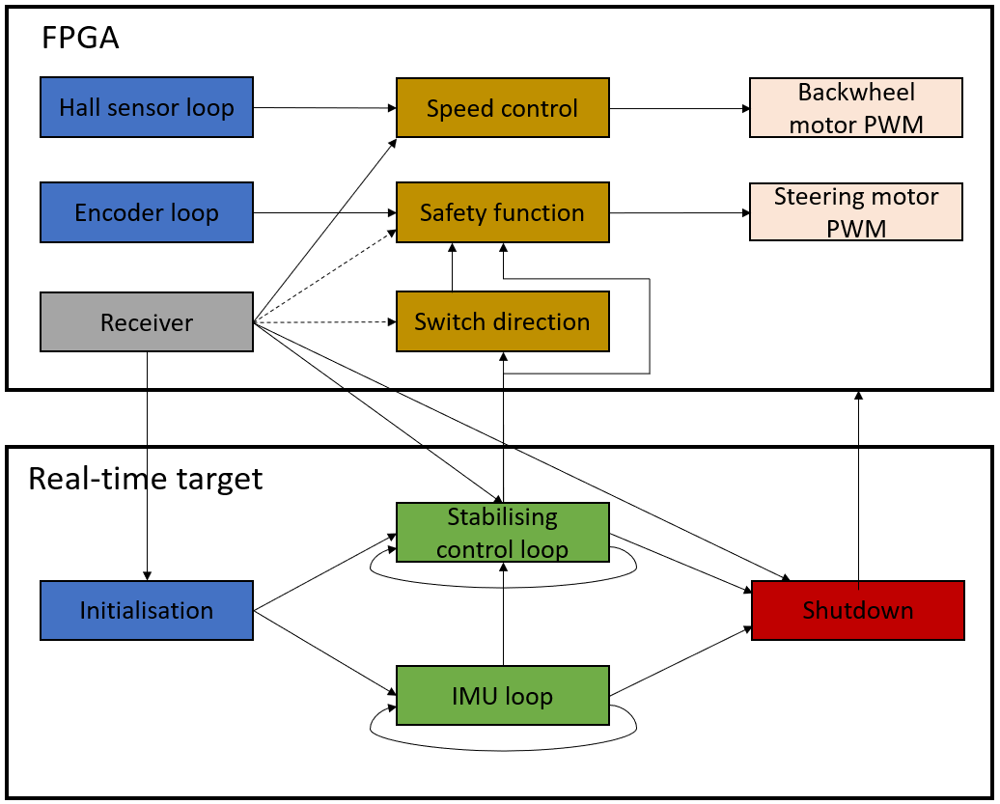

# Programming

## Overview

In this project, I/O operations are made from both the FPGA and RT target of the roboRIO. Since there is not any hybrid mode on the roboRIO, it is quite a challenge to setup I/O on both the RT target and the FPGA and make it work simultaneously. The solution used in this project was to copy and modify the customised FPGA personality, and use this bit file for both the project and in the 'Open FPGA VI Reference'. This procedure is explained in detail in the software manual.

In the initialisation phase of the software, the FPGA is started and the correct bit file is loaded into it. When the communication LED is red the code is ready for the IMU bias calculations, and the channel 7 switch should be turned on. After the bias calculations are done, the communication LED is turned green and the main loop and IMU starts to execute. When the brake command from the RC controller is executed, the communication LED is turned off. An overview of the LabVIEW modules can be seen in the figure below.

## Steering Motor Encoder

The output from the encoder is a quadrature phase signal, which is made out of two square waves shifted 90 degrees from each other. When the motor is running at maximum speed the two square waves from the encoder have a frequency of approximately 65 KHz each. Because of Nyquist theorem, the decoder has to run at a rate of at least 130 KHz. To make sure that we do not miss any pulses and to utilise the power of the roboRIO, the encoder is implemented in a single cycle timed loop on the FPGA. To send data between the FPGA and RTOS multiple Read/Write Control VIs from the FPGA palette are utilised. The position of the handlebar is sent both to the RT system to be used as an input for stabilising the bicycle, and to another loop on the FPGA which acts as an safety function and do not allow the handlebar to pass ±45 degrees. To send data between the different loops on the FPGA, local variables are utilised.

## Steering Motor Controller

To control the steering motor, a PWM signal is generated on the FPGA target with a frequency and duty cycle determined by the control loop used for stabilising the bicycle. To control the direction of the motor, a digital high or low is sent through a digital I/O from the FPGA. As mentioned in the previous section a safety function is also present and if the position of the handlebar is ±45 degrees the steering motor gets a PWM signal with duty cycle of 0%; if the switch direction button is pressed the motor starts function normally again.

## IMU

The raw data from the IMU is transferred to the roboRIO with SPI communication. On the master device, in this case the roboRIO, the raw data is read on RT target utilising the SPI express VI. To be able to transfer data, a digital Chip Select (CS) signal has to be set low before transmission and set high after the transmission is completed. With the different CS it is possible to communicate with multiple slaves using the same communication bus. 

To initialise the communication with the IMU, a number of registers and offsets are configured on the IMU from the roboRIO. The 16 bit raw data are computed to a gyroscope and accelerometer value using the equation below.

The bias is calculated in the initialisation phase of the code, where 3000 readings from the gyroscope and accelerometer are averaged and a bias value is produced for each axis for both the accelerometer and gyroscope. When the bias is calculated it is important that the bicycle is in an upright position standing as still as possible. The sensitivity value is found in the MPU9250 data sheet, and are set using the  GYRO\_FS\_SEL and ACCEL\_FS\_SEL in register 27 and 28 respectively for the gyroscope and accelerometer. The gyroscope sensitivity is currently set to 16.4 and the accelerometer sensitivity is 2048.

To acquire the roll and pitch values, the values from the accelerometer and gyroscope are merged and the rapid changes of the accelerometer and the slow changes from the gyroscope are neglected using a complementary filter. In the equation below an example of how the roll angle is calculated is shown; the procedure for the pitch angle is similar but with data from y-axis of the gyro and the pitch contribution from the accelerometer.

