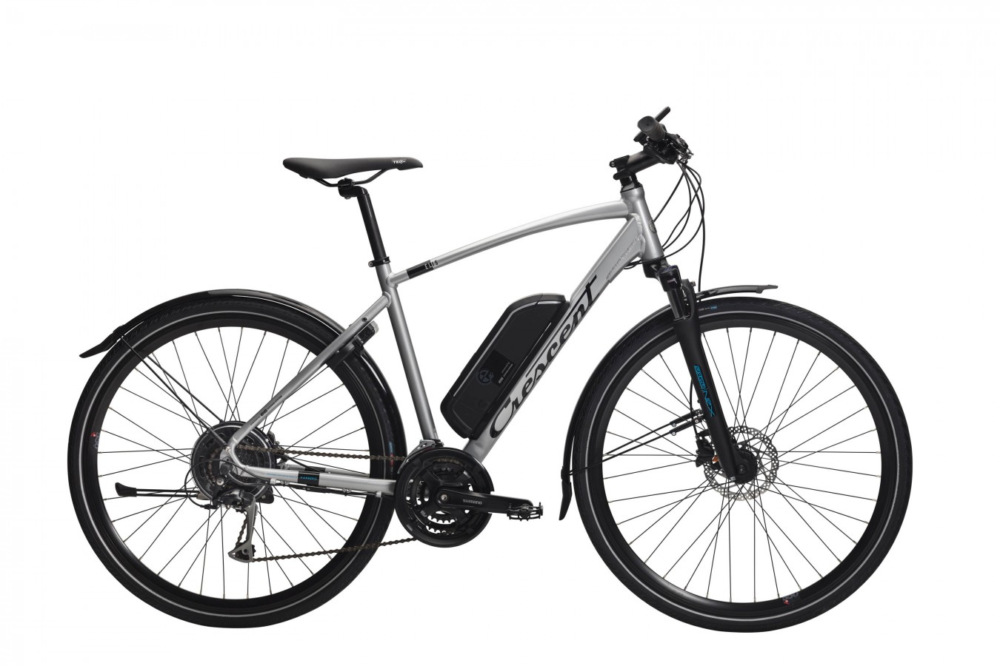

# Project Overview

## Bicycle Platform
Chosen as a platform for the project is the Crescent electric bicycle ELis. It is a rear-wheel driven male model in size 51, with 24 gears and a semi-integrated battery in the frame. 

## Background and Motivation

Constructing a self-stabilising bicycle is an ideal challenge for a student project. This particular project was established as an initiative between Mälardalen University and Chalmers University in the autumn of 2017, with the aspiration of prototyping an autonomous bicycle fit for use in conjunction with other autonomous vehicles. In this specific case, the purpose is to test the safety systems in the autonomous vehicles manufactured by Volvo Cars against the autonomous bicycle so that it can verify these systems under controlled circumstances. The bicycle constructed last year was however not adequate to develop further, since the system in question was built around a front-wheel driven bicycle, which is not ideal when specifying a suitable dynamic model. Thus, in the autumn of 2018, the project was restarted.

## Goals

The goals set for this iteration of the project is to by remote control have the bicycle balance, have the bicycle autonomously move in a straight line from point A to point B in an indoor environment while balancing itself, and holding a specified velocity of 15-15.5km/h. Additionally, the bicycle should be capable of carrying a dummy load of 8kg. Lastly, a computer simulation of the bicycle balancing is to be created in order to easier test the system. The aspiration is to achieve both remote control and autonomy for the bicycle, however the primary target is the former of the two. This will be achieved by creating a sufficient electrical-, sensor-, and mechanical system, backed by corresponding software controlling the separate modules.

## Tasks

The tasks required in order to achieve the goal of an autonomous bicycle are therefore firstly to create a simulation where the bicycle is able to balance through the use of a control algorithm with a feedback system. In addition to this, adequate electrical and mechanical systems need to be contructed to support the execution of the controller. This includes a steering system for the front fork, a braking system, a speed control system, a lean angle measurement system, as well as a remote control to have control of the bicycle even from a distance.

## Current Status

The current status of the bicycle is laid out in the sections below.

### Electronics
- All of the modules of the bicycle are finished and work as expected
- New motor driver is in process of being integrated for higher accuracy and ability to "lock" velocity

### Mechanics
- The intended mechanical structures are all in place
- Supporting wheels has been scrapped for now but might be added if deemed necessary

### Control
- Most of work focused on the tuning of the dynamic model and achieving a good simulation
- Port of code from LabVIEW to Simulink have started

### Future Work
- Turning
- Dummy not available for integration
- Off-the-shelf PDB
- Navigation
